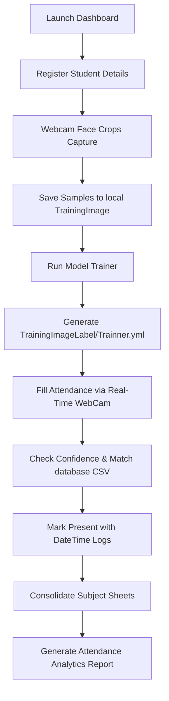

# Class Vision: Attendance Management System Using Face Recognition

A highly robust, neat, and secure computer vision-based attendance tracking platform. Class Vision automates student cataloging and attendance logging via real-time biometric face detection, local binary descriptors, and pandas-driven spreadsheet consolidation.

---

## 🚀 Key Features

*   **Real-time Facial Biometrics**: Leverages high-accuracy OpenCV Haar Cascade Classifiers to isolate and crop facial regions instantly from the webcam stream.
*   **LBPH Recognition Classifier**: Integrates **Local Binary Patterns Histograms (LBPH)**, a robust spatial-texture face recognition model that is highly resilient to variations in lighting, background noise, and pose.
*   **Intuitive Desktop Dashboard**: A beautifully organized dark-themed Tkinter GUI, with vibrant interactive buttons, stylized icons, and clear tabular data viewers.
*   **Auditory Feedback System**: Features built-in Text-to-Speech (TTS) vocal guidance using `pyttsx3` to provide audible cues, warnings, and success confirmations.
*   **Merged Attendance Analytics**: Automatically matches, aggregates, and computes attendance statistics (such as attendance percentage) across all active sessions using Pandas.
*   **Manual Administration Console**: Includes a secure manual entry desktop portal (`takemanually.py`) to mark attendance when biometric capture is unavailable.

---

## 🛠️ System Architecture

Below is the logical workflow of the Attendance Management System:



---

## 📂 File Anatomy

The project directory is structured cleanly to separate presentation layers, computational models, database records, and generated assets:

```text
├── Attendance/                      # Consolidated and session-level CSVs per subject
│   ├── math/
│   └── phy/
├── Attendance(Manually)/            # Manually recorded attendance logs
├── StudentDetails/                  # Student registration data
│   └── studentdetails.csv           # Maps Enrollment ID -> Name
├── TrainingImageLabel/              # Directory holding trained models
│   └── Trainner.yml                 # Serialized LBPH recognition weights
├── UI_Image/                        # Image assets for the GUI dashboard
├── attendance.py                    # Main launcher and central dashboard dashboard
├── automaticAttedance.py            # Real-time face detection & marking module
├── takeImage.py                     # Captures cropped facial datasets
├── trainImage.py                    # Builds and saves the LBPH model
├── show_attendance.py               # Aggregates, calculates percentages, & renders data tables
├── takemanually.py                  # Standalone manual attendance administrator
└── haarcascade_frontalface_default.xml  # Haar Cascade Frontal Face model
```

---

## 📦 Prerequisites & System Setup

### 1. Requirements

*   **Operating System**: Windows (Tested and verified) or macOS/Linux.
*   **Python**: Version 3.6 or higher.

### 2. Installation Steps

Clone the repository or navigate to the project directory, then install the necessary dependencies using your preferred terminal tool:

```bash
pip install -r requirements.txt
```

#### Content of `requirements.txt`:
*   `numpy` (Linear algebra & matrix array operations)
*   `opencv-contrib-python` (OpenCV with extra modules including face recognition)
*   `opencv-python` (Core Computer Vision tools)
*   `openpyxl` (Excel sheet engines)
*   `pandas` (Consolidation and data manipulation)
*   `pillow` (Advanced image resizing and loading for GUI)
*   `pyttsx3` (Offline Text-to-Speech library)

---

## 🖥️ Operational User Guide

Follow these steps to run and test the complete attendance pipeline:

### Step 1: Start the Dashboard
Launch the central application:
```bash
python attendance.py
```

### Step 2: Register a New Student
1. Click **Register a new student**.
2. Enter a unique integer **Enrollment No** (e.g., `101`) and the student's **Name** (e.g., `Alice`).
3. Click **Take Image**.
   * The webcam will activate.
   * Sit comfortably in standard lighting. The algorithm will capture and store **50 cropped grayscale face frames** inside the `./TrainingImage` folder.
   * You will hear a speech confirmation when complete.

### Step 3: Train the Biometric Model
1. Once images are recorded, click **Train Image** on the registration screen.
2. The LBPH engine will compile the facial characteristics and serialize the weights file into `TrainingImageLabel/Trainner.yml`.

### Step 4: Run Real-time Automatic Attendance
1. On the main dashboard, click **Take Attendance**.
2. Input the Subject Name (e.g., `math`) and click **Fill Attendance**.
3. The webcam launches:
   * **Recognized Faces**: Rendered with a **green bounding box** showing their `ID - Name`.
   * **Unknown Faces**: Rendered with a **red bounding box** showing `Unknown`.
4. Press `q` or `ESC` (or wait for the timer to complete) to close the camera stream.
5. The session attendance file will be generated instantly and shown in a neat grid display.

### Step 5: View Consolidated Reports & Percentages
1. Click **View Attendance** on the dashboard.
2. Enter the subject name (e.g. `math`) and click **View Attendance**.
3. The program will scan all past session sheets, calculate the **average attendance percentage** for each student, and display the consolidated master file (`attendance.csv`).

## ⚙️ Deep-Dive: Facial Recognition & LBPH Mechanics

Class Vision utilizes a two-tier biometric processing pipeline combining face detection and texture-based classification:

### 1. Face Detection via Haar Cascades
The system uses the Viola-Jones object detection framework (`haarcascade_frontalface_default.xml`) to scan frames for facial structures. This works by computing rectangular Haar-like features:
*   Calculates the difference between the sum of pixels in adjacent rectangular regions.
*   Uses an **Integral Image** representation to perform feature extraction in constant time ($O(1)$).
*   Applies a cascade of increasingly complex classifiers to quickly reject non-face windows.

### 2. Texture Classification via LBPH (Local Binary Patterns Histograms)
Once the face region is cropped and converted to grayscale, the LBPH algorithm processes the image to extract micro-level texture vectors:
*   **LBP Operator**: Evaluates each pixel in a $3\times3$ neighborhood. If the neighbor's intensity is greater than or equal to the center pixel, it is labeled `1`; otherwise, it is labeled `0`. This yields an 8-bit binary string (e.g., `11001011`), which is converted to its decimal equivalent (0–255).
*   **Grid Division**: The LBP image is divided into $N\times M$ spatial regions (grids) to preserve local spatial structural information.
*   **Histogram Computation**: A local histogram of LBP values is computed for each grid representing local texture characteristics.
*   **Feature Vector**: All local histograms are concatenated into a single master histogram representing the face.
*   **Matching & Thresholds**: During inference, the Chi-Square distance ($D_{\chi^2}$) between the test face histogram and the trained dataset histograms is computed:
    $$D_{\chi^2}(x, y) = \sum_{i} \frac{(x_i - y_i)^2}{x_i + y_i}$$
    A **confidence distance score $< 70$** indicates a successful match, whereas scores above 70 indicate high divergence and are labeled as `Unknown`.

---

## 📈 Tips for Maximizing Accuracy

To obtain the best recognition performance, keep the following environment recommendations in mind:
*   **Direct Diffused Lighting**: Avoid harsh backlighting or overhead spots that create dramatic shadows on facial contours. 
*   **Consistent Head Alignment**: When capturing the 50 registration frames via **Take Image**, slowly tilt and rotate your head slightly to capture different facial angles (yaw/pitch).
*   **Reduce Frame Blur**: Ensure the camera focus is sharp and standard capture distance (approx. 0.5 to 1 meter) is maintained.

## 📝 License & References

*   **Haar Cascade Classifiers**: Developed and licensed by Intel under the standard 3-clause BSD License ([OpenCV Cascades GitHub](https://github.com/opencv/opencv/tree/master/data/haarcascades)).
*   **LBPH Recognition**: Supported through `opencv-contrib-python` wrappers.
